# 🚀 JobFit AI: The 16-Agent "Panel of Experts"
### ADK Native Orchestration for Precision Career Coaching


**JobFit AI** is an orchestration engine that replaces generic resume advice with a **"Panel of Experts"**. Instead of a single prompt, it orchestrates **16 specialized agents** using Google's Agent Development Kit (ADK) to parse, research, evaluate, and tailor job applications with human-level reasoning.

---

## 🧠 The "Why" & "What"

Applying for jobs is broken. Generic AI tools hallucinate skills, while human recruiters are overwhelmed.

**JobFit AI** solves this by simulating a hiring committee. It doesn't just "write a resume"; it first decides if you are a good fit. It employs **Parallel** agents to digest data, **Sequential** evaluators to debate your candidacy (Technical, Domain, Seniority, Language), and **Quality Control** agents to check for bias and hard constraints before generating a single line of text.

## ⚡ Key Features

*   **🏗️ 16-Agent Architecture**: Full segregation of duties (Parser, Researcher, Evaluator, Writer, Auditor).
*   **🔄 ADK Native Patterns**: Demonstrates `ParallelAgent` for data ingestion and `SequentialAgent` for the expert evaluation chain.
*   **🛡️ "Evaluation as Code"**: Dedicated `ConstraintChecker` and `RiskChecker` agents prevent hallucinations and ensure hard requirements (e.g., Visa, Language) are met.
*   **🧠 Contextual Memory**: `UserMemory` and `CompanyMemory` services cache research and history to avoid redundant processing.
*   **⚖️ The "Panel of Experts"**: Separate scoring for **Technical**, **Domain**, **Seniority**, and **Language** fit (0-100 scale).

---

## 🏗️ System Architecture

JobFit AI moves beyond simple chains. It uses a sophisticated multi-phase architecture:

```mermaid
graph TD  
subgraph Inputs  
U[User CV]  
J[Job Desc]  
end

subgraph "Phase 1: Parallel Ingestion (ADK ParallelAgent)"
    direction TB
    P1[📄 CV Parser Agent]
    P2[📋 Job Parser Agent]
    P3[🏢 Company Researcher]
end

subgraph "Phase 2: The Panel of Experts (ADK SequentialAgent)"
    direction TB
    E1[🛠️ Tech Fit Evaluator]
    E2[🌍 Domain Fit Evaluator]
    E3[👔 Seniority Evaluator]
    E4[🗣️ Language Evaluator]
end

subgraph "Phase 3: Quality Control"
    Q1[📊 Fit Aggregator]
    Q2[🚫 Constraint Checker]
    Q3[⚖️ Risk/Bias Checker]
end

subgraph "Phase 4: Lazy Generation"
    G1[✍️ Resume Tailor]
    G2[✉️ Cover Letter Writer]
end

Inputs --> P1 & P2 & P3
P1 & P2 & P3 --> E1
E1 --> E2 --> E3 --> E4
E4 --> Q1
Q1 --> Q2 --> Q3
Q3 --> Output{Go / No-Go?}
Output -- "Strong Fit" --> G1 & G2
Output -- "Weak Fit" --> F[Feedback Report]
```



## 🚀 How to Run

### Option A: Kaggle (Recommended)
This project is designed to run natively in a Kaggle Notebook environment.
1. Open the notebook in Kaggle.
2. Add your `GOOGLE_API_KEY` to **Add-ons > Secrets**.
3. Run All. The **Gradio UI** will launch at the bottom of the notebook.

### Option B: Local Installation
1. Clone this repo:
git clone [https://github.com/rafdouglas/JobFit_AI.git](https://github.com/rafdouglas/JobFit_AI.git)  
cd jobfit-ai

2. Install dependencies:
```pip install -r requirements.txt```

3. Set your API key (Linux/Mac):

```export GOOGLE_API_KEY="your_key_here"```

4. Launch the app:

---

## 📸 User Flow

The application is designed with a "Privacy First" approach. No data is sent to the cloud until you explicitly click "Analyze".

```mermaid
sequenceDiagram  
actor User  
participant UI as 🖥️ Gradio Interface  
participant Orch as 🤖 ADK Orchestrator  
participant Mem as 💾 Memory Service

User->>UI: Upload CV (PDF/DOCX)
User->>UI: Paste Job URL/Text
User->>UI: Click "Analyze Fit"

rect rgb(240, 248, 255)
    note right of UI: Analysis Phase (30s)
    UI->>Orch: Trigger Parallel Parsers
    Orch->>Mem: Cache Company Research
    UI->>Orch: Trigger Expert Panel
    Orch-->>UI: Stream Progress...
end

UI->>User: Display Scorecard (0-100) & Gaps

opt User Decides to Apply
    User->>UI: Click "Generate Resume"
    UI->>Orch: Trigger Resume Agent (Lazy Load)
    Orch-->>UI: Return Tailored DOCX
end
```


---

## 🛠️ Technologies Used

*   **Core Logic**: Python 3.10+
*   **AI Model**: `gemini-2.5-flash-lite` (via Google GenAI SDK)
*   **Orchestration**: Google ADK (Agent Development Kit)
*   **Interface**: Gradio (Blocks API)
*   **Tools**: `pdfplumber`, `python-docx`

---

## 📜 License

Distributed under the **Apache 2.0** License. See `LICENSE` for more information.

---

*Built for the Google & Kaggle AI Agents Intensive Capstone 2025.*
